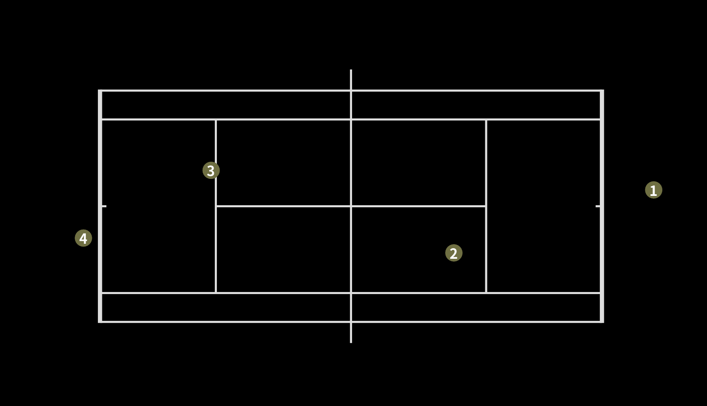

# Tennis Registration v3
## Prepare the environment
1. DeepSORT environment
```
cd YOLOv9_DeepSORT
pip install -r requirements.txt
```
2. YOLOv9 environment
```
cd yolov9
pip install -r requirements.txt
```
3. UI environment (cpp-OpenCV & sysv_ipc)

[cpp-OpenCV v4.7.0 in Ubuntu (Here is the tutorial)](https://blog.csdn.net/wxyczhyza/article/details/128968849)

```
pip install sysv_ipc
```

## Demo
You can use the code below to simply run the demo.
```
python tennis_registration.py
```
After running all frames, you will see the result in the terminal. This is the position of every player in the image coordinate.
```
[[      31.76      8.2214]
 [     22.868      10.646]
 [     11.693      7.4278]
 [     6.3028      9.9999]]
```
Or if you want to see the result, you can run the ui at the same time.
```
cd ui
./shr_tennis_ui
```
Then you will see like the image below.
<p align="center">
  
</p>

## Usage
You can use your own params to run the program with the code below.
```
python tennis_registration.py --video <str> --conf <float 0~1> --blur_id <int> --class_id <int> --cam_id <int>
```
### Params
If you just simply test its performance in different perspectives, just change its **video** and **cam_id** params.

| Params        | Function   |  Default  |
| :----:   | :-----:  | :----:  |
| video     | Path to input video or video stream (input '0') |   './data/video_3.mp4'     |
| conf        |   confidence threshold    |  0.50  |
| blur_id        |    class ID to apply Gaussian Blur    |  None  |
| class_id        |    class ID to track   |  0  |
| cam_id        |    camera perspective ID to track    |  3  |


### Supplements
#### ① If you need to use **Stream Mode**, pls apply this two code in **tennis_registration.py** after you connect the camera. Then input **'0'** to **video** param. And don't forget to change **a correct camera index** to calculate homography matrix. (You can rewrite **cam_dict** in **object_tracking_stream** to fix the correspondence between cameras and indexs)
```
# from YOLOv9_DeepSORT.yolov9.object_tracking_stream import person_track_stream
```
```
# person_track_stream(FLAGS)
```

Because I cannot connect my computer with cameras in the stadium, I commented them out while debugging the code. (If there are bugs when using Stream Mode, pls contact me...)

#### ② The code of video stream is in **object_tracking_stream.py**, and the code of video file is in **object_tracking.py**
They use different methods to get frames: class PYLON_SHM and VideoCapture function in OpenCV.

#### ③ The indexs of videos in the **data** folder are corresponding to the indexs of cameras.
```
video: video_0.mp4 -> cam_id: 0
video: video_1.mp4 -> cam_id: 1
video: video_2.mp4 -> cam_id: 2
video: video_3.mp4 -> cam_id: 3
```

## References
[YOLOv9_DeepSORT](https://github.com/sujanshresstha/YOLOv9_DeepSORT/tree/main)

[Learn Homography: 相机标定系列（二）单应矩阵](https://blog.csdn.net/qq_42118719/article/details/112347552)

[Homography Applcation: OpenCV-Python单应矩阵（Homography Matrix）应用——更换广告牌](https://blog.csdn.net/wp_bigdata/article/details/119085970)